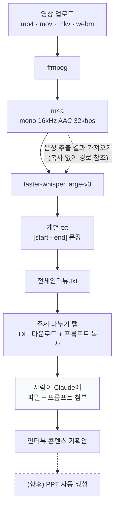

# 인터뷰 처리 도구

## 1. 프로젝트 소개

인터뷰 영상에서 음성을 뽑고, 받아쓰고, 기록할 주제로 나누는 **사내 내부 도구**.
기존에 Google Colab + Python 스크립트로 하던 작업을 웹으로 옮긴 것이다.

지향하는 전체 흐름:

```
영상 → 음성 추출 → 텍스트 추출 → 전체 인터뷰 통합 → 주제 분석 → (향후) 콘텐츠 구성
```

사용 규모는 직원 몇 명 수준이며, 로컬 또는 사내 서버에서 돌린다.

> **문서 원칙** — 이 README는 "현재 작동하는 것"과 "계획"을 섞지 않는다.
> 2장은 실제로 구현·검증된 것만, 3장은 아직 없는 것만 적는다.

---

## 2. 현재 구현 기능

화면은 상단 탭 세 개(`음성 추출` · `텍스트 추출` · `주제 나누기`)로 나뉜다.

### 인증
- 이메일/비밀번호 로그인 (계정은 환경변수로만 관리)
- httpOnly 세션 쿠키, 요청마다 갱신되는 슬라이딩 만료(기본 12시간)
- 로그아웃 시 서버에서 토큰 즉시 폐기
- 미인증 시 앱 화면 자체를 렌더하지 않음 → 뒤로가기로도 접근 불가
- 세션 만료 시 안내와 함께 로그인 화면으로 복귀
- `/api/auth/*`, `/api/health` 를 뺀 모든 API는 401로 보호

### 음성 추출
- 영상 여러 개 업로드 (드래그 앤 드롭 / 파일 선택), 업로드 진행률 표시
- 지원 형식: `.mp4` `.mov` `.m4v` `.mkv` `.webm`
- ffmpeg로 `.m4a` 변환 — **영상 제거 / mono / 16 kHz / AAC / 32 kbps**
- 파일별 상태(대기 · 변환 중 · 완료 · 실패)와 진행률, 전체 진행 상황
- 한 파일이 실패해도 나머지는 계속 처리
- 음성 트랙이 없는 영상은 개별 실패로 표시
- 브라우저에서 바로 재생, 개별 다운로드, 전체 ZIP 다운로드
- 원본 파일명 유지(확장자만 `.m4a`), 한글 파일명 보존

### 텍스트 추출
- `.m4a` 여러 개 업로드 (`.mp3` `.wav` 도 허용)
- `음성 추출 결과 가져오기` — 같은 세션의 m4a를 **복사 없이** 목록에 추가
- faster-whisper `large-v3` 한국어 받아쓰기 (`beam_size=5`, `vad_filter=True`)
- 결과 txt는 `[0.00 - 7.90] 문장` 형식 (UTF-8)
- 파일별 상태·진행률, 한 파일 실패 시 격리
- 브라우저에서 본문 확인, 텍스트 복사, 개별 TXT 다운로드
- `모든 받아쓰기를 하나의 파일로 합치기` → 통합 txt 생성
- 전체 ZIP 다운로드 (개별 txt + 통합 txt)

### 주제 나누기
> **외부 LLM API를 호출하지 않는다.** API 키도 필요 없다. 11장 참고.

- 전체 흐름 안내 (파일 준비 → 프롬프트 복사 → Claude에 첨부 → 결과 확인)
- 같은 세션의 `전체인터뷰.txt` 를 찾아 파일명·글자 수와 함께 표시, 바로 다운로드
- 통합 파일이 없으면 안내와 `텍스트 추출로 이동` 버튼
- 기록 주제 구성용 전용 프롬프트 전문 표시 (읽기 전용, 내부 스크롤)
- `프롬프트 복사` — 클립보드 복사, 완료 시 성공 표시
- `프롬프트 TXT 다운로드` — `주제나누기_프롬프트.txt` (브라우저에서 생성)
- `Claude 열기` — 새 탭으로 Claude 웹 열기 (로그인·업로드 자동화는 하지 않음)

### 공통
- 세션 단위 임시 저장소, 마지막 접근 기준 TTL 자동 정리 (10장)
- 서버 재시작 시 이전 잔여 파일 정리

---

## 3. 향후 예정 기능 (계획)

아래는 **아직 구현되지 않았다.**

- 주제 분석 자동화 — 현재는 Claude에서 사람이 직접 실행한다 (11장)
- 주제 분석 결과 → **PPT 자동 생성**
- 콘텐츠 초안 생성 (영상 구성안, 내레이션 등)
- 화자 분리(diarization)
- 결과의 영구 보관 / 회원 관리 / 프로젝트 단위 히스토리
- 여러 사용자 동시 작업을 위한 작업 큐

---

## 4. 데이터 흐름



`주제 나누기 탭` 까지가 이 도구의 범위다. 그다음 단계는 사람이 Claude에서 직접 실행한다.
점선은 아직 계획인 부분이다.

---

## 5. 폴더 구조

```
interview-polish-tool/
├── package.json                    pnpm 워크스페이스 루트 (dev/build/lint/test)
├── pnpm-workspace.yaml
├── .gitignore
├── README.md
│
├── shared/
│   └── src/index.ts                프론트·백엔드 공유 타입, 지원 확장자,
│                                   ffmpeg 인자, Whisper 기본값, 이야기 유형
│
├── backend/
│   ├── .env                        실제 설정 (git 제외)
│   ├── .env.example                설정 템플릿
│   ├── src/
│   │   ├── server.ts               실행 진입점 · 청소 스케줄러 · 종료 처리
│   │   ├── app.ts                  Express 앱 조립 · 인증 미들웨어 배치
│   │   ├── config.ts               모든 환경변수를 읽는 유일한 곳
│   │   ├── routes/
│   │   │   ├── auth.ts             로그인 · /me · 로그아웃
│   │   │   ├── health.ts           ffmpeg · Whisper · LLM 사용 가능 여부
│   │   │   ├── api.ts              음성 추출
│   │   │   └── transcripts.ts      텍스트 추출
│   │   ├── lib/
│   │   │   ├── auth.ts             계정 파싱 · 세션 토큰 · requireAuth
│   │   │   ├── sessions.ts         세션 저장소 · 작업 큐 · TTL 청소 (가장 큼)
│   │   │   ├── ffmpeg.ts           probe · 음성 변환 · 진행률 파싱
│   │   │   ├── transcriber.ts      파이썬 워커 수명 관리 · 작업 전달
│   │   │   ├── filenames.ts        한글 파일명 복구 · 확장자 · ZIP/통합 파일명
│   │   │   └── errors.ts           HttpError · ExtractError
│   ├── python/
│   │   ├── transcribe_worker.py    faster-whisper 상주 워커 (모델 1회 로드)
│   │   ├── requirements.txt
│   │   └── .venv/                  파이썬 가상환경 (git 제외)
│   ├── tests/                      node:test 통합 테스트
│   └── storage/                    세션별 임시 파일 (git 제외, 10장)
│
└── frontend/
    ├── vite.config.ts              dev 서버 · /api 프록시 · 워처 제외 목록
    ├── playwright.config.ts        E2E (백엔드+프론트를 별도 포트로 함께 띄움)
    ├── src/
    │   ├── App.tsx                 AuthGate · 라우트
    │   ├── auth/
    │   │   ├── AuthProvider.tsx    로그인 상태 · 세션 확인 · 만료 처리
    │   │   └── Login.tsx           로그인 화면
    │   ├── components/
    │   │   ├── AppShell.tsx        헤더 · 탭 네비게이션 · 로그아웃
    │   │   ├── Dropzone.tsx        드래그앤드롭 업로드 (두 탭 공용)
    │   │   ├── StatusBadge.tsx     대기/처리중/완료/실패 뱃지
    │   │   └── ProgressBar.tsx
    │   ├── prompts/
    │   │   └── topicSplit.prompt.txt   Claude에 전달할 프롬프트 원문
    │   ├── pages/
    │   │   ├── AudioExtractPage.tsx
    │   │   ├── TextExtractPage.tsx
    │   │   └── TopicSplitPage.tsx
    │   └── lib/
    │       ├── api.ts              API 클라이언트 (업로드는 XHR로 진행률)
    │       ├── authEvents.ts       401 → 세션 만료 전달
    │       ├── jobSession.ts       작업 세션 id 보관 (탭 단위)
    │       └── format.ts           크기 · 길이 표시
    └── tests/                      Playwright E2E
```

---

## 6. 주요 파일 설명

| 파일 | 역할 |
|---|---|
| `backend/src/config.ts` | **환경변수를 읽는 유일한 곳.** 새 설정을 추가하면 여기부터 |
| `backend/src/app.ts` | 라우터 배치. 어떤 경로가 인증을 요구하는지 여기서 결정 |
| `backend/src/lib/auth.ts` | `AUTH_USERS` 파싱, 세션 토큰 발급/검증, `requireAuth` 미들웨어 |
| `backend/src/lib/sessions.ts` | 세션 상태·파일 경로·작업 큐·TTL 청소. 세 기능이 모두 여기를 거친다 |
| `backend/src/lib/ffmpeg.ts` | ffmpeg 실행. 변환 인자는 `shared` 의 `FFMPEG_AUDIO_ARGS` 가 원본 |
| `backend/src/lib/transcriber.ts` | 파이썬 워커를 **첫 요청 때 한 번** 띄우고 재사용, 유휴 시 종료 |
| `backend/python/transcribe_worker.py` | 상주 워커. 모델을 한 번만 로드하고 JSON Lines로 통신 |
| `frontend/src/prompts/topicSplit.prompt.txt` | Claude에 넘길 프롬프트 원문. **프롬프트 수정은 이 파일만** |
| `backend/src/lib/filenames.ts` | 한글 파일명 복구(latin1→UTF-8, NFD→NFC), 확장자 처리 |
| `frontend/src/auth/AuthProvider.tsx` | 로그인 상태(`loading`/`unauthenticated`/`authenticated`)와 세션 만료 |
| `frontend/src/App.tsx` | `AuthGate` — 미인증이면 라우터 자체를 렌더하지 않음 |
| `frontend/src/lib/api.ts` | 모든 API 호출. 쿠키 동봉, 401 감지, 업로드 진행률 |
| `shared/src/index.ts` | 두 쪽이 공유하는 계약. 지원 확장자와 변환 설정의 단일 진실원천 |

---

## 7. 최초 설치

```bash
# 1. clone
git clone https://github.com/withalive/interview-polish-tool.git
cd interview-polish-tool

# 2. Node 의존성 (워크스페이스 전체)
pnpm install

# 3. ffmpeg (음성 추출에 필요)
brew install ffmpeg            # macOS
# sudo apt install ffmpeg      # Ubuntu / Debian

# 4. 받아쓰기용 파이썬 환경
cd backend/python
python3.11 -m venv .venv
.venv/bin/pip install -r requirements.txt
cd ../..

# 5. 환경변수
cp backend/.env.example backend/.env
#   → backend/.env 를 열어 AUTH_USERS 의 비밀번호를 바꾼다

# 6. 실행
pnpm dev
```

브라우저에서 <http://127.0.0.1:5273> 접속.

### 필요 버전

| 항목 | 버전 | 비고 |
|---|---|---|
| Node.js | ≥ 20 | `--env-file-if-exists` 사용 |
| pnpm | ≥ 11 | `packageManager: pnpm@11.0.6` |
| Python | 3.11 권장 | faster-whisper 휠 호환성 |
| ffmpeg | 최신 | `ffprobe` 도 함께 설치됨 |

---

## 8. 실행 방법

한 번에 띄우기:

```bash
pnpm dev        # 백엔드(4000) + 프론트엔드(5273) 동시 실행
```

나눠서 띄우려면 —

**터미널 1 (백엔드)**
```bash
pnpm --filter backend dev
# → http://127.0.0.1:4000
```

**터미널 2 (프론트엔드)**
```bash
pnpm --filter frontend dev
# → http://127.0.0.1:5273  (/api 는 4000으로 프록시)
```

> **`.env` 를 고치면 백엔드를 수동 재시작해야 한다.**
> `--watch` 는 소스만 감시하고 `.env` 는 시작할 때 한 번만 읽는다.

---

## 9. 환경변수

모두 `backend/.env` 에 둔다. 프론트엔드는 환경변수를 쓰지 않는다
(`API_PROXY_TARGET` 만 E2E 테스트가 내부적으로 사용).

### 필수

| 변수 | 필수 | 기본값 | 용도 |
|---|---|---|---|
| `AUTH_USERS` | **Y** | 없음 | 로그인 계정. `이메일:비밀번호:그룹` 쉼표 구분 |

코드에 기본 계정이 없다. 미설정 시 아무도 로그인할 수 없고 **서버가 시작할 때 경고를 남긴다.**
`backend/.env.example` 의 placeholder 를 실제 값으로 바꿔 `backend/.env` 에 둔다.

### 주제 나누기

**설정할 환경변수가 없다.** 외부 LLM API를 호출하지 않으므로 API 키가 필요 없다.

### 서버 · 저장소

| 변수 | 기본값 | 용도 |
|---|---|---|
| `PORT` | `4000` | API 포트 |
| `STORAGE_ROOT` | `backend/storage` | 임시 파일 루트 |
| `MAX_UPLOAD_BYTES` | `4294967296` (4 GB) | 파일당 업로드 상한 |
| `MAX_FILES_PER_UPLOAD` | `50` | 한 번에 올릴 수 있는 개수 |
| `SESSION_TTL_MS` | `21600000` (6시간) | 세션 보관 시간 (마지막 접근 기준) |
| `SWEEP_INTERVAL_MS` | `600000` (10분) | 청소 주기 |
| `DELETE_SOURCE_AFTER_EXTRACT` | `true` | 변환 성공 후 원본 영상 삭제 |
| `EXTRACT_CONCURRENCY` | `1` | 동시 음성 변환 개수 |

### 인증 세부

| 변수 | 기본값 | 용도 |
|---|---|---|
| `AUTH_SESSION_TTL_MS` | `43200000` (12시간) | 로그인 유지 시간 |
| `AUTH_COOKIE_NAME` | `interview_session` | 세션 쿠키 이름 |
| `AUTH_COOKIE_SECURE` | `false` | HTTPS 뒤에 둘 때 `true` |

### 외부 실행 파일 · 모델

| 변수 | 기본값 | 용도 |
|---|---|---|
| `FFMPEG_PATH` / `FFPROBE_PATH` | `ffmpeg` / `ffprobe` | 실행 파일 경로 |
| `PYTHON_PATH` | `backend/python/.venv/bin/python` | 워커용 파이썬 |
| `WHISPER_MODEL` | `large-v3` | 받아쓰기 모델 (테스트는 `tiny`) |
| `TRANSCRIBER_IDLE_MS` | `1800000` (30분) | 유휴 시 워커 종료 |
| `TRANSCRIBER_STARTUP_MS` | `1800000` (30분) | 모델 로딩 대기 한도 |

워커가 추가로 읽는 값 (보통 건드리지 않음):
`WHISPER_LANGUAGE`(`ko`), `WHISPER_BEAM_SIZE`(`5`), `WHISPER_VAD_FILTER`(`true`),
`WHISPER_DEVICE`, `WHISPER_COMPUTE_TYPE`.

---

## 10. Storage 구조

> **영구 데이터베이스가 아니라 작업용 임시 저장소다.**
> 회원·프로젝트 개념이 없고, 결과는 사용자가 다운로드해 가져가는 것을 전제로 한다.

```
backend/storage/
  _incoming/                        업로드 중인 청크 (multer 임시)
  <sessionId>/
    uploads/        <fileId>.mp4    업로드한 원본 영상
    outputs/        <fileId>.m4a    추출된 음성
    audio/          <fileId>.m4a    텍스트 추출용으로 직접 올린 음성
    transcripts/    <fileId>.txt    받아쓰기 결과
                    combined.txt    통합 받아쓰기
    topic-analysis/ input.txt       주제 분석 대상 원문
                    result.json     주제 분석 결과 (수정본 포함)
```

디스크에는 `<fileId>` (UUID)로만 쓰고, 한글 원본 파일명은 메모리 메타데이터로 들고 있다가
다운로드 시 `Content-Disposition`(RFC 5987)으로 복원한다. 파일시스템 인코딩 문제를 만들지 않기 위함이다.

### 정리 방식

| 시점 | 동작 |
|---|---|
| 변환 성공 직후 | 원본 영상 삭제 (`DELETE_SOURCE_AFTER_EXTRACT=false` 로 끌 수 있음) |
| 변환 실패 | 원본 유지 (재시도 가능) |
| 목록에서 삭제 | 해당 파일 즉시 삭제 |
| 10분마다 | 마지막 **접근** 후 6시간 지난 세션 폴더 삭제 |
| 서버 시작 시 | 이전 실행이 남긴 폴더 전부 삭제 |

TTL 기준이 생성 시각이 아니라 **마지막 접근 시각**이고 조회·재생·다운로드도 접근으로
집계되므로, 결과를 받기 전에 사라지지 않는다. 작업이 진행 중인 세션은 청소 대상에서 제외된다.

> **세션 상태는 메모리에 있다.** 백엔드를 재시작하면 진행 중이던 작업과 목록이 사라지고,
> 디스크의 잔여 파일도 정리된다.

---

## 11. 주제 나누기 방침

### 현재 방식

현재 버전에서는 **LLM API를 프로젝트에 직접 연결하지 않는다.**

텍스트 추출 완료 후 생성된 `전체인터뷰.txt` 와 시스템이 제공하는 전용 프롬프트를
사용자가 **Claude에 직접 첨부**하여 주제별 콘텐츠 기획안을 생성한다.
별도의 LLM API 비용 없이 이미 사용 중인 Claude 환경을 활용하기 위한 방식이다.

```
전체인터뷰.txt  +  주제나누기_프롬프트.txt
            ↓
      사람이 Claude에 첨부
            ↓
      인터뷰 콘텐츠 기획안
```

따라서 이 프로젝트는:

- **API 키가 필요 없다** — `.env` 에 LLM 관련 설정이 없다
- **외부 LLM로 나가는 요청이 0회다** — E2E 테스트로 검증한다
  (`frontend/tests/topics.spec.ts` 의 "이 페이지는 외부로 어떤 요청도 보내지 않는다")
- LLM SDK 의존성이 없다 (`@anthropic-ai/sdk` 미사용)

주제 나누기 탭은 순수 프론트엔드 화면이다. 프롬프트는 빌드 시점에 번들에 포함되고,
TXT 다운로드도 브라우저에서 Blob으로 만든다. 서버를 거치지 않는다.

### 프롬프트 수정

프롬프트는 [`frontend/src/prompts/topicSplit.prompt.txt`](frontend/src/prompts/topicSplit.prompt.txt)
**한 파일에만** 있다. 일반 텍스트 파일이므로 코드를 몰라도 고칠 수 있고,
Vite 의 `?raw` import 로 빌드에 포함된다. 고친 뒤 프론트엔드를 다시 빌드하면 된다.

프롬프트는 기존에 사람이 수작업으로 만든 인터뷰 기록 주제 구성 자료와 비슷한 수준의
결과를 목표로 한다 — 큰 주제 / 작은 주제, 기억하기 쉬운 제목, 이야기 유형
(사실 기록형 · 서사형 · 일 이야기형 · 인물형), 키워드, ①②③ 이야기 순서,
의미 / 강조 포인트, 추가 인터뷰 질문.

### 향후 LLM API를 연결하게 된다면

비용을 감수하고 자동화가 필요해지면 다음 위치에 추가한다.
**지금은 해당 코드가 없다.**

| 목적 | 권장 위치 |
|---|---|
| provider 호출 | `backend/src/lib/llm.ts` (신설) |
| 분석 로직 | `backend/src/lib/topicAnalysis.ts` (신설) |
| 프롬프트 | `backend/src/prompts/` 로 이동 |
| API | `backend/src/routes/topics.ts` → `app.ts` 에 `requireAuth` 와 함께 등록 |
| 설정 | `backend/src/config.ts` 에 추가 후 `.env.example` 에 기록 |

그때 지켜야 할 원칙:

- **API 키는 backend 환경변수로만 관리한다.** 코드에 넣지 않는다
- **frontend에는 어떤 경우에도 키를 노출하지 않는다.** 호출은 전부 백엔드에서
- 실제 secret은 Git에 커밋하지 않는다 (`.env` 는 `.gitignore` 에 있다)
- 인터뷰 본문은 서버 로그·브라우저 콘솔 어디에도 남기지 않는다
- 특정 provider에 묶이지 않도록 service layer에서 분리한다

```
TopicAnalysisService
        ↓
LLM Provider Adapter
        ├─ Anthropic
        ├─ OpenAI
        └─ AWS Bedrock
```

### API Key 운영 (향후)

| 환경 | 방법 |
|---|---|
| 로컬 개발 | `backend/.env` (git 제외) |
| 운영 | AWS Secrets Manager / SSM Parameter Store, 또는 배포 환경의 secret 주입 |

**운영 서버에 실제 키를 GitHub 코드로 배포하지 않는다.**

## 12. API 목록

`/api/auth/*` 와 `/api/health` 를 제외한 모든 경로는 **로그인 필요**(없으면 401).

### 인증

| Method | Endpoint | 설명 | 인증 |
|---|---|---|---|
| POST | `/api/auth/login` | 로그인, 세션 쿠키 발급 | - |
| GET | `/api/auth/me` | 현재 로그인 사용자 | 쿠키 |
| GET | `/api/auth/status` | 로그인 여부만 확인 | - |
| POST | `/api/auth/logout` | 로그아웃, 서버에서 토큰 폐기 | - |
| GET | `/api/health` | ffmpeg · Whisper · LLM 사용 가능 여부 | - |

### 세션 · 음성 추출

| Method | Endpoint | 설명 | 인증 |
|---|---|---|---|
| POST | `/api/sessions` | 작업 세션 생성 | Y |
| GET | `/api/sessions/:id` | 영상 목록 · 상태 · 진행률 (폴링) | Y |
| POST | `/api/sessions/:id/files` | 영상 업로드 (multipart `files`) | Y |
| DELETE | `/api/sessions/:id/files/:fileId` | 목록에서 제거 | Y |
| POST | `/api/sessions/:id/extract` | 음성 추출 시작 (202 즉시 반환) | Y |
| GET | `/api/sessions/:id/files/:fileId/audio` | m4a 스트리밍 (`?download=1`) | Y |
| GET | `/api/sessions/:id/archive` | 전체 m4a ZIP | Y |
| DELETE | `/api/sessions/:id` | 세션·파일 즉시 삭제 | Y |

### 텍스트 추출

| Method | Endpoint | 설명 | 인증 |
|---|---|---|---|
| GET | `/api/sessions/:id/transcripts` | 받아쓰기 목록 · 상태 (폴링) | Y |
| POST | `/api/sessions/:id/transcripts/files` | 음성 업로드 | Y |
| POST | `/api/sessions/:id/transcripts/adopt` | 음성 추출 결과 가져오기 (복사 없음) | Y |
| DELETE | `/api/sessions/:id/transcripts/files/:fileId` | 목록에서 제거 | Y |
| POST | `/api/sessions/:id/transcripts/combine` | 통합 옵션 켜기/끄기 | Y |
| POST | `/api/sessions/:id/transcripts/start` | 받아쓰기 시작 (202) | Y |
| GET | `/api/sessions/:id/transcripts/files/:fileId/text` | 개별 txt | Y |
| GET | `/api/sessions/:id/transcripts/combined` | 통합 txt | Y |
| GET | `/api/sessions/:id/transcripts/archive` | 전체 ZIP (개별 + 통합) | Y |

> 주제 나누기 탭은 **전용 API가 없다.** 통합 받아쓰기 조회·다운로드에
> 기존 `transcripts` API를 그대로 쓰고, 프롬프트는 프론트엔드 번들에 들어 있다.

오래 걸리는 작업은 모두 **202로 즉시 반환하고 백그라운드로 진행**하며,
프론트는 상태 조회를 폴링한다. 요청 타임아웃과 무관하고 화면을 닫아도 계속 진행된다.

---

## 13. 테스트

```bash
pnpm typecheck                  # 3개 워크스페이스 타입 검사
pnpm lint                       # ESLint
pnpm build                      # 프론트엔드 빌드 + 백엔드 타입 검사
pnpm --filter backend test      # 단위 + 통합 (실제 ffmpeg · Whisper 사용)
pnpm --filter frontend test     # Playwright E2E (Chrome)
```

- 백엔드 테스트는 ffmpeg로 테스트 영상을, macOS `say` 로 한국어 음성을 직접 만들어 쓴다.
  외부 네트워크가 필요 없다.
- 받아쓰기 테스트는 속도 때문에 `WHISPER_MODEL=tiny` 로 고정한다.
- 주제 나누기 E2E 는 프롬프트 표시·복사·다운로드와 **외부 요청이 0건인지**를 확인한다.
- E2E는 백엔드(4100)와 프론트엔드(5274)를 별도 포트로 함께 띄우며,
  `backend/.env` 를 읽지 않고 테스트 전용 계정(`tests/testAccount.ts`)을 주입한다.

---

## 14. 인수인계 시 확인사항

**환경 구성**
- [ ] `backend/.env` 는 **Git에 포함되지 않는다.** 새로 만들어야 한다 (`.env.example` 복사)
- [ ] **관리자 계정 비밀번호는 별도 경로로 전달**받아야 한다 (문서·코드에 없음)
- [ ] ffmpeg 설치 필요 (`brew install ffmpeg`)
- [ ] 파이썬 가상환경을 직접 만들어야 한다 (`backend/python/.venv`)

**첫 실행 시 알아둘 것**
- [ ] Whisper `large-v3` 모델(약 3 GB)이 **첫 텍스트 추출 때 자동 다운로드**된다.
      `~/.cache/huggingface` 에 캐시되며, 처음 한 번은 몇 분 걸린다
- [ ] `large-v3` 는 **CPU 환경에서 느리다.** GPU가 있으면 자동으로 `cuda`/`float16` 을 쓴다
- [ ] 모델이 메모리를 수 GB 차지한다. 30분 유휴면 워커가 내려간다
- [ ] 백엔드를 재시작하면 진행 중이던 작업과 임시 파일이 사라진다

**주제 나누기**
- [ ] **LLM API를 사용하지 않는다.** API 키 발급이 필요 없다
- [ ] 프롬프트 수정은 `frontend/src/prompts/topicSplit.prompt.txt` 한 파일만
- [ ] 결과는 사용자가 Claude에서 직접 받는다. 도구는 파일과 프롬프트까지만 준비한다

**배포 시**
- [ ] secret은 코드가 아니라 배포 환경의 환경변수/Secrets Manager로 주입
- [ ] `AUTH_COOKIE_SECURE=true` (HTTPS 뒤에 둘 때)
- [ ] `STORAGE_ROOT` 의 디스크 여유 확인 (영상이 수백 MB 단위)
- [ ] 현재 구조는 **단일 프로세스·메모리 상태** 전제다. 다중 인스턴스로 띄우려면
      세션 저장소를 외부(Redis 등)로 빼야 한다
